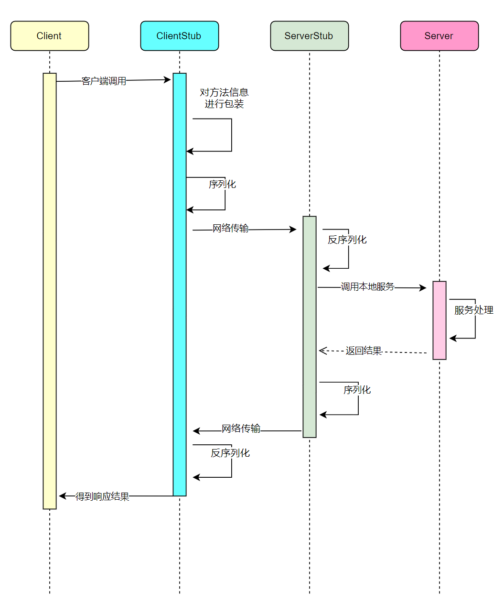
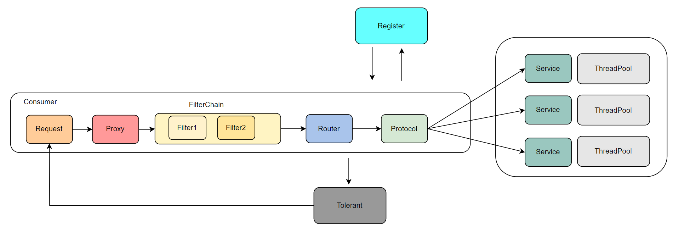

### 项目介绍
基于```Netty``` + ```Zookeeper``` 开发的一款RPC(远程过程调用)框架。并且基于SpringBoot开发了自定义starter，使用
```@VRefence```在调用端指向远程服务 + ```@VRpcService```在服务端暴露服务。支持服务注册、发现，负载均衡，支持多种序列化框架

### 项目模块树
#### 总体模块
```
├─rpc-framework-consumer                    -> 客户端测试
│  ├─rpc-framework-consumer-demo            -> 普通环境下
│  └─rpc-framework-consumer-spring          -> spring环境下
├─rpc-framework-core                        -> rpc项目核心代码
├─rpc-framework-interface                   -> 测试接口
├─rpc-framework-provider                    -> 服务端测试
│  ├─rpc-framework-provider-demo            -> 普通环境下
│  └─rpc-framework-provider-spring          -> spring环境下
└─rpc-framework-spring-boot-starter         -> 自定义spring-boot-starter 
```
#### core核心模块
```
├─client                                    -> 客户端相关类（启动类、连接管理类）
├─common                                    -> 通用包
│      ├─annotation                         -> 注解类
│      ├─cache                              -> 缓存类（客户端缓存、服务端缓存）
│      ├─config                             -> 配置类（客户端配置、服务端配置、配置加载类、配置读取类）
│      ├─constant                           -> 常量
│      ├─event                              -> 事件相关
├─dispatcher                                -> 服务端任务派发
├─filter                                    -> 过滤器（客户端过滤器、服务端过滤器）                                     
├─proxy                                     -> 代理层
├─registry                                  -> 接入注册中心层
├─router                                    -> 路由层
├─serialize                                 -> 序列化层
├─server                                    -> 服务端相关类（启动类、连接管理类、服务暴露类）
└─spi                                       -> spi插拔式组件相关（自定义加载类）支持key-value加载类
```
### 项目总体流程
#### 环境准备
- IDEA
- JDK 8
- Maven 3
- Zookeeper 单机或集群

#### 测试流程示例
方式一：
1. 将项目克隆到本地
    ```
    https://github.com/avvCode/v-rpc.git
    ```
2. 使用IDEA打开项目
   使用 IDEA 打开，等待项目初始化完成。
3. 开启Zookeeper
    默认式localhost，需要修改成自己的
4. 修改配置文件
5. 启动项目
6. 打开浏览器测试

### 实现概述
#### 整体结构


#### 代理层 Proxy
1.1 支持JDK代理

1.2 支持Javassist代理
#### 注册中心层 Registry
2.1 支持 Zookeeper注册中心

#### 路由层 Router
3.1 随机路由

3.2 轮训路由 

#### 序列化层 Serialize

4.1 支持JDK序列化

4.2 支持Hessian序列化

4.3 支持Kryo序列化
 
4.4 支持FastJson序列化

测试码流大小作为评判序列化的优劣

#### 添加职责链 Filter

服务分组、直连调用、token鉴权

5.1 支持服务分组

5.2 支持ip直连（发现两个相同服务返回结果不同指定ip进行debug）

5.3 添加请求日志（请求时间、调用方信息、请求方法）、

#### 支持SPI可插拔式组件
6.1 自定义key-value式类加载方式

6.2 实行按需加载（懒加载模式）

#### 请求接收与请求处理解耦
7.1 改造服务端只在一个Handler中处理请求为**缓冲队列** + **业务线程池**处理请求

#### 容错层设计
8.1 支持客户端接收并显示服务端异常

8.2 服务端接口限流

8.3 客户端支持超时重试